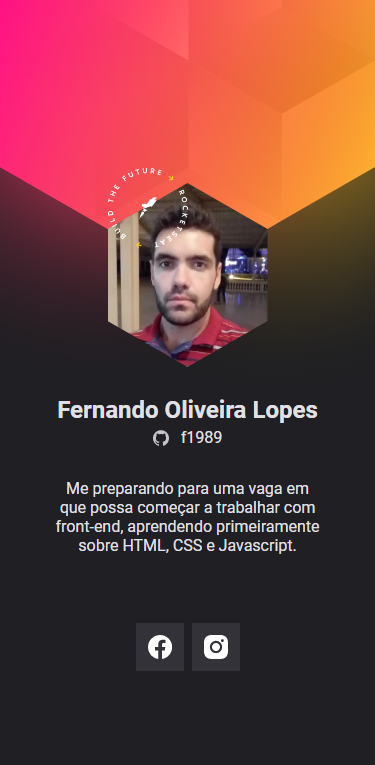

<h1 align="center">
    Crachá DoWhile 2021
</h1>

<p align="center">
  <a href="#-projeto">Projeto</a>&nbsp;&nbsp;&nbsp;|&nbsp;&nbsp;&nbsp;
  <a href="#-ferramentas">Ferramentas</a>&nbsp;&nbsp;&nbsp;|&nbsp;&nbsp;&nbsp;
  <a href="#-tecnologias">Tecnologias</a>&nbsp;&nbsp;&nbsp;|&nbsp;&nbsp;&nbsp;
  <a href="#-rodando">Rodando</a>&nbsp;&nbsp;&nbsp;|&nbsp;&nbsp;&nbsp;
  <a href="#-layout">Layout</a>&nbsp;&nbsp;&nbsp;|&nbsp;&nbsp;&nbsp;
  <a href="#-licença">Licença</a>
</p>

<br/>

<p align="center">
    
</p>

<br/>

## 💻 PROJETO

<p align="justify">
O projeto do crachá virtual DoWhile2021 foi construído seguindo os conceitos das boas práticas de programação e alinhado ao que há de melhor e mais moderno na tecnologia atual, visando o propósito de aprender mais os conceitos e técnicas de HTML, CSS e JavaScript. Ele puxa algumas informações trazidas da conta do usuário pela API do GitHub.
</p>

<br/><br/>

## 🛠 FERRAMENTAS

Durante o desenvolvimento deste projeto foi utilizado os seguintes softwares:

- Ambiente de programação: [VSCode](https://code.visualstudio.com/)
- Navegador WEB: [Chrome](https://www.google.com/intl/pt-BR/chrome/) ou [Edge](https://www.microsoft.com/pt-br/edge)


<br/><br/>

## 🚀 TECNOLOGIAS

Esse projeto foi desenvolvido com as seguintes tecnologias:

- HTML
- CSS
- Javascript

<br/><br/>

## 🧭 RODANDO

```bash

# Clone este repositório
$ git clone https://github.com/f1989/crachadowhile2021

# Acesse a pasta do projeto no VSCode
$ cd cracha

# Instale a extensão "Live Server" diretamente pelo VSCode

# Clique com o botão direito do mouse em cima do arquivo "index.html" e escolha a opção "Open with Live Server" 
A aplicação iniciará na porta 5500 OU abra o navegador e digite http://localhost:5500 ou http://127.0.0.1:5500/

```

<br/><br/>

## 🔖 LAYOUT

Você pode visualizar o layout do projeto através [desse link](https://www.figma.com/file/bVPY9Y6300VXwMf522hnCt/). É necessário ter conta no [Figma](http://figma.com/) para acessá-lo.

<br/><br/>

## 📝 LICENÇA

Esse projeto está sob a licença MIT. Veja o arquivo [LICENSE](LICENSE.md) para mais detalhes.

<br/>

---

<p align="justify">
    Feito por Fernando Oliveira Lopes durante a Sétima Edição da NLW (Heat) - Next Level Week, na Missão Origin, da Rocketseat, que ocorreu de 18/10/2021 à 22/10/2021.
</p>

Visite: 
<br/>
[Rocketseat](https://rocketseat.com.br/)
<br/>
[NLW - Next Level Week](https://nextlevelweek.com/)